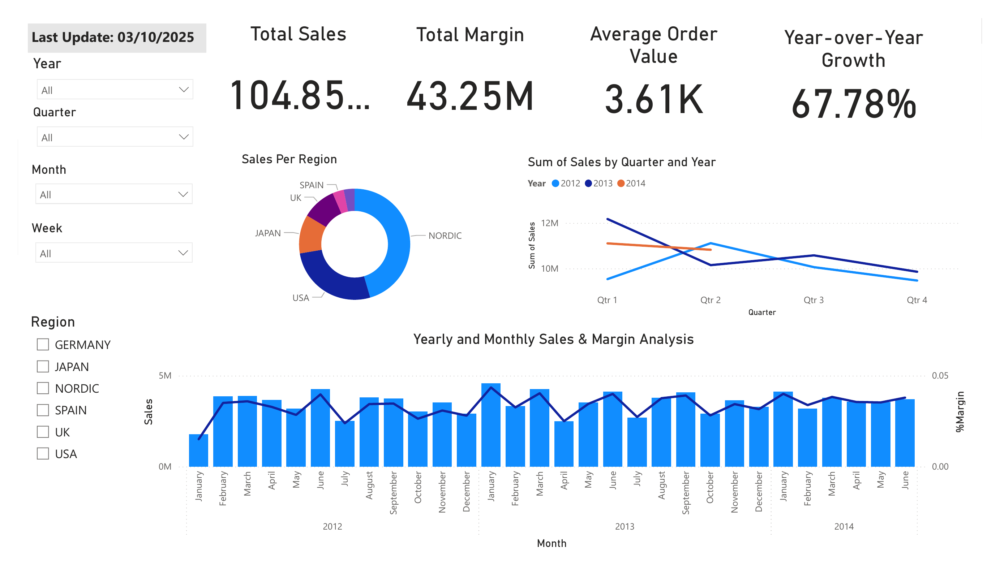
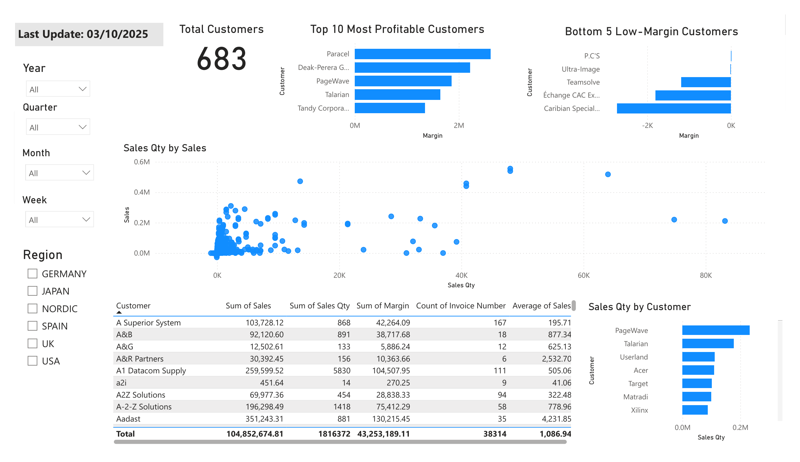
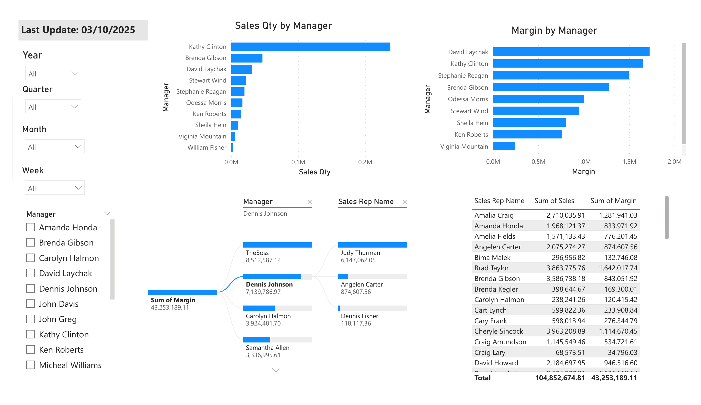
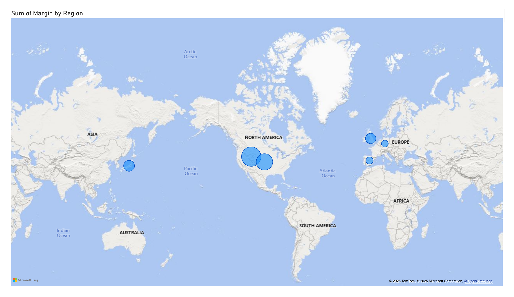

# 📊 Sales Performance Dashboard — Power BI Project

## 🔍 Quick Overview

This project showcases a complete end-to-end **business intelligence solution** developed with **Power BI** for a fictional B2B company, *GoodSales*. The goal was to design a **fully interactive dashboard** for executive decision-making using real-world business datasets (clients, products, sales, teams, and geography).

We built a **star schema model**, integrated multiple sources, and developed rich visuals to analyze **sales**, **margins**, **top clients**, **regional performance**, and **manager efficiency**.

🔗 **Report PDF**: [Rapport_Power_BI.pdf](./Rapport_Power_BI%20%282%29.pdf)

---

## 🧠 Key Objectives

- Import and model multiple tables using Power BI's data model.
- Design a **star schema** centered on the `SalesOrders` fact table.
- Provide **KPI-driven insights**: sales, margin, growth, order volume.
- Offer **dynamic filtering** across year, region, manager, and client.
- Build dashboards to support **client segmentation** and **sales strategy** decisions.

---

## 🛠 Data Sources

| File               | Description                            |
| ------------------ | -------------------------------------- |
| `SalesOrders.xlsx` | Fact table: sales amount, cost, margin |
| `Customers.xlsx`   | Client names and regions               |
| `Items.xlsx`       | Product hierarchy and type             |
| `Regions.txt`      | Geographic mapping                     |
| `SalesTeam.xlsx`   | Sales representatives and managers     |

---

## 🧩 Data Modeling

- Implemented a **star schema**:
  - **Fact table**: `SalesOrders`
  - **Dimension tables**: `Customers`, `Items`, `Regions`, `SalesTeam`, and calendar date
- Established clear **1-to-many relationships**
- Created a **ManagersTable** to isolate unique manager info

📌 Key Metric Calculations:

- `Total Sales`, `Total Margin`, `Average Order Value`
- `Year-over-Year Growth`
- Margins by product, region, and manager

---

## 📈 Dashboard Pages

### 1. **Sales Overview**
- KPIs: Total Sales (104.85M), Margin (43.25M), Avg Order (3.61K), Growth (67.78%)
- Visuals: sales by region, year-quarter evolution, monthly trend

### 2. **Client Analysis**
- Top 10 profitable clients
- Sales and margin heatmap
- Sales quantity correlation and distribution
- Drill-through with filters: year, quarter, region

### 3. **Manager Performance**
- Bar charts: sales & margin by manager
- TreeMap: sales contribution per representative
- Detailed performance table

### 4. **Regional Margins**
- Interactive map of margin by geography
- Insights on best-performing regions
- Europe and North America dominate margin distribution

---

## 🧰 Stack Used

| Tool       | Usage                              |
| ---------- | ---------------------------------- |
| Power BI   | Data modeling and dashboard design |
| Excel      | Raw data preparation               |
| DAX        | Measures and calculated KPIs       |
| M Language | Data transformation in Power Query |

---

## 🌱 Improvement Ideas

- Add supplier tables for deeper supply chain insights
- Integrate sales targets to benchmark performance
- Use machine learning (e.g., forecasting trends)
- Add seasonality and goal tracking dashboards

---

## 🖼️ Dashboard Previews

### Page 1 — Sales Overview

### Page 2 — Client Analysis

### Page 3 — Product Performance

### Page 4 — Manager & Team Performance

### Page 5 — Margin by Region (Map)

---
